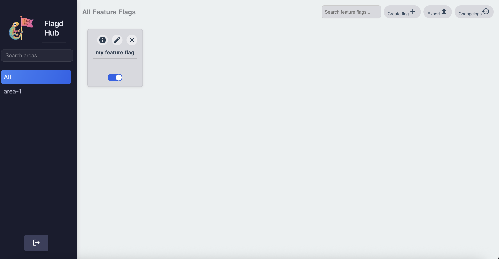
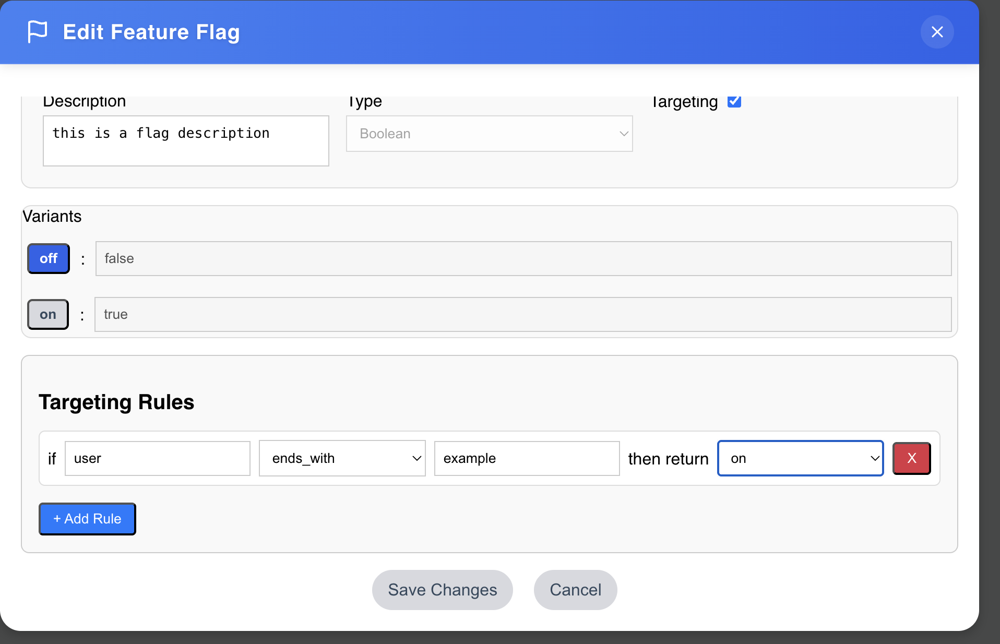
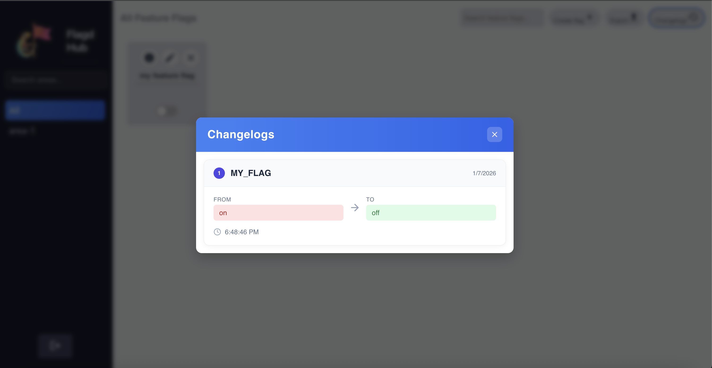
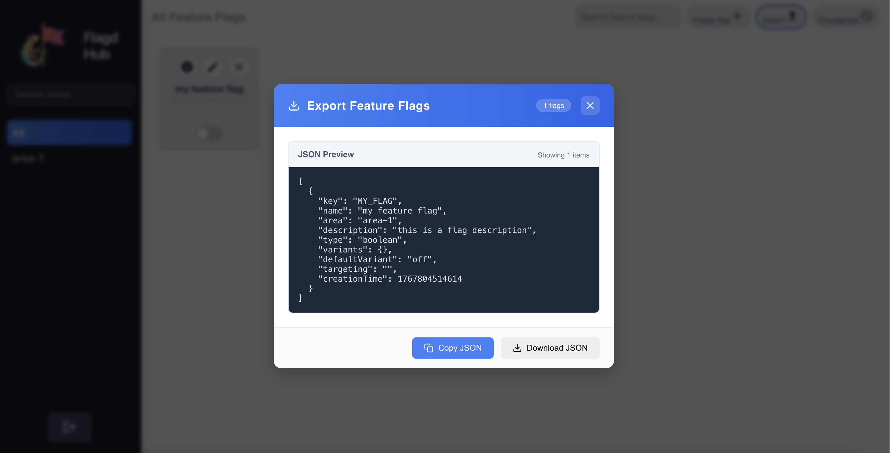

# Flagd-Hub

[](https://opensource.org/licenses/Apache-2.0)
[](https://github.com/arielberkovich/Flagd-Hub/actions/workflows/ci.yml)

A comprehensive web-based management interface for [flagd](https://github.com/open-feature/flagd), the OpenFeature-compliant feature flag daemon. Flagd-Hub simplifies feature flag management by providing an intuitive UI, RESTful API, and flag configuration for flagd instances.

## Screenshots

### Main Interface


### Targeting Rules


### Change Log


### Export Functionality


## Overview

**Flagd-Hub** bridges the gap between flagd's powerful feature flag evaluation capabilities and the need for a user-friendly management interface. It enables teams to create, update, and manage feature flags without manual JSON file editing, while maintaining full compatibility with flagd's configuration format.

### Key Features

- **Intuitive Web Interface**: simple UI for managing feature flags
- **RESTful API**: Spring Boot backend with comprehensive REST endpoints
- **Flagd Integration**: Serves flagd-compatible configuration via dedicated endpoint
- **Secure by Default**: JWT-based authentication with configurable security
- **Change Auditing**: Complete changelog tracking for flag modifications
- **Docker Ready**: Full containerization with Docker Compose setup
- **E2E Testing**: Playwright test suite for reliability

## Architecture

```
┌─────────────────┐      ┌──────────────────┐      ┌─────────────┐
│  Flagd-Hub UI   │─────▶│  Flagd-Hub API   │─────▶│    Redis    │
│   (React/TS)    │      │  (Spring Boot)   │      │   (storage) │
└─────────────────┘      └──────────────────┘      └─────────────┘
                                  │
                                  ▼
                          ┌──────────────┐
                          │    flagd     │
                          │   (Consumer) │
                          └──────────────┘
```

### Components

- **flagd-hub-ui**: React frontend with Material-UI components
- **flagd-hub-api**: Spring Boot backend with REST API and Redis integration
- **flagd-hub-e2e**: Playwright end-to-end test suite
- **flagd**: OpenFeature feature flag evaluation daemon (included in docker-compose)
- **Redis**: data store for flag configuration and caching

## Prerequisites

- **Docker & Docker Compose**: For containerized deployment
- **Node.js 20+**: For UI development
- **JDK 17**: For backend development
- **Gradle**: Build tool for backend
- **flagd**: Running instance to consume flag configurations

## Quick Start

### Using Docker Compose (Recommended)

1. **Clone the repository**
   ```bash
   git clone https://github.com/your-username/Flagd-Hub.git
   cd Flagd-Hub
   ```

2. **Build Docker images**
   ```bash
   chmod +x build-images.sh
   ./build-images.sh
   ```

3. **Start all services**
   ```bash
   docker compose up -d
   ```

4. **Access the application**
   - UI: http://localhost:3000
   - API: http://localhost:8090
   - flagd: http://localhost:8013
   - Redis GUI: http://localhost:8001

5. **Default credentials**
   - Username: `admin`
   - Password: `admin`

**Note:** The docker-compose setup includes a flagd instance that automatically connects to Flagd-Hub's `/flagd/configuration` endpoint to consume feature flags.

### Configure flagd to Use Flagd-Hub

Point your flagd instance to Flagd-Hub's configuration endpoint:

```bash
flagd start \
  --uri http://localhost:8090/flagd/configuration \
  --sync-provider http
```

Or using Docker:

```bash
docker run -p 8013:8013 \
  ghcr.io/open-feature/flagd:latest \
  start \
  --uri http://host.docker.internal:8090/flagd/configuration \
  --sync-provider http
```

## Development Setup

### Backend (flagd-hub-server)

```bash
cd flagd-hub-server

# Build the project
./gradlew build

# Run tests
./gradlew test

# Run the application
./gradlew bootRun
```

The API will be available at `http://localhost:8090`

### Frontend (flagd-hub-ui)

```bash
cd flagd-hub-ui

# Install dependencies
npm install

# Configure environment
cp .env.example .env
# Edit .env with your settings

# Start development server
npm start
```

The UI will be available at `http://localhost:3000`

### E2E Tests (flagd-hub-e2e)

```bash
# Install Playwright browsers
cd flagd-hub-e2e
npx playwright install chromium

# Start services
docker compose up -d

# Run tests
./gradlew test

# Or use the convenience script
./run-tests.sh
```

See [flagd-hub-e2e/GETTING_STARTED.md](flagd-hub-e2e/GETTING_STARTED.md) for detailed testing documentation.

## Configuration

### Environment Variables

#### Flagd-Hub API

| Variable | Description | Default | Required |
|----------|-------------|---------|----------|
| `ADMIN_USERNAME` | Admin username for authentication | `admin` | Yes |
| `ADMIN_PASSWORD` | Admin password for authentication | `admin` | Yes |
| `IS_SECURED` | Enable JWT authentication | `false` | No |
| `SECRET_KEY` | JWT signing secret (min 256 bits) | - | Yes (if IS_SECURED=true) |
| `TOKEN_EXPIRATION_IN_HOURS` | JWT token lifetime in hours | `24` | No |
| `REDIS_HOST` | Redis server hostname or IP | `localhost` | Yes |
| `REDIS_PORT` | Redis server port | `6379` | Yes |
| `REDIS_PASSWORD` | Redis authentication password | `` (empty) | No |
| `CORS_ALLOWED_ORIGINS` | Comma-separated list of allowed CORS origins | `http://localhost:3000` | Yes |
| `FEATURE_FLAGS_JSON_PATH` | Path to JSON file for importing flags on startup | - | No |

**Flag Storage Location:**
- All feature flags are stored in **Redis** using Spring Data Redis
- Flags are persisted as key-value pairs in Redis with JSON serialization
- The API reads/writes flags from Redis in real-time
- The `/flagd/configuration` endpoint queries Redis to generate flagd-compatible JSON configuration

#### Flagd-Hub UI

| Variable | Description | Default |
|----------|-------------|---------|
| `REACT_APP_FLAGD_HUB_API_URL` | API endpoint URL | `http://localhost:8090` |
| `REACT_APP_IS_SECURED` | Enable authentication | `true` |

### Security Considerations

- Change default admin credentials in production
- Use strong JWT secret keys (minimum 256 bits)
- Enable Redis password authentication
- Configure appropriate CORS origins
- Use HTTPS in production environments
- Review and restrict network access to Redis

## API Documentation

### Authentication Endpoints

- `POST /api/auth/login` - Authenticate user
  - Returns JWT token for subsequent requests

### Feature Flag Management

- `GET /api/flags` - List all feature flags
- `POST /api/flags` - Create new feature flag
- `PUT /api/flags/{id}` - Update feature flag
- `DELETE /api/flags/{id}` - Delete feature flag
- `PUT /api/flags/{id}/default-variant` - Change default variant

### Flagd Configuration

- `GET /flagd/configuration` - Get flagd-compatible configuration (JSON)
  - This endpoint is consumed by flagd instances
  - Returns flags in OpenFeature flagd format

### Changelog

- `GET /api/changelog` - Retrieve flag change history

## Feature Flag Structure

Flagd-Hub uses the standard flagd flag configuration format:

```json
{
  "flags": {
    "my-feature": {
      "state": "ENABLED",
      "variants": {
        "on": true,
        "off": false
      },
      "defaultVariant": "on"
    }
  }
}
```

## Project Structure

```
Flagd-Hub/
├── flagd-hub-ui/              # React frontend
│   ├── src/
│   │   ├── components/        # React components
│   │   ├── services/          # API client services
│   │   └── utils/             # Utility functions
│   └── package.json
│
├── flagd-hub-server/          # Spring Boot backend
│   ├── flagd-hub-api/         # API module
│   │   └── src/main/java/org/flagd/hub/
│   │       ├── controllers/   # REST controllers
│   │       ├── services/      # Business logic
│   │       ├── repositories/  # Data access
│   │       └── configuration/ # App configuration
│   └── swagger-schemas/       # OpenAPI schemas
│
├── flagd-hub-e2e/             # E2E test suite
│   └── src/test/java/com/flagdhub/e2e/
│       ├── tests/             # Test scenarios
│       ├── pages/             # Page objects
│       └── fixtures/          # Test fixtures
│
├── docker-compose.yaml        # Service orchestration
├── build-images.sh            # Docker build script
```

## Continuous Integration

This project uses GitHub Actions for automated testing and validation. The CI pipeline runs on every push to `main` and on all pull requests.

### CI Pipeline Steps

1. **Backend Unit Tests** - Runs `./gradlew test` in the server module
2. **Build Docker Images** - Builds both UI and server Docker images
3. **Start Services** - Brings up the full stack with `docker compose up`
4. **Health Checks** - Verifies all services are running and healthy
5. **E2E Tests** - Runs the full Playwright test suite

### Viewing CI Results

- CI status badge is displayed at the top of this README
- Click the badge to view detailed workflow runs
- Test reports and traces are uploaded as artifacts for failed runs

### Running CI Locally

You can run the same checks locally:

```bash
# Run backend unit tests
cd flagd-hub-server
./gradlew test

# Build images and start services
./build-images.sh
docker compose up -d

# Run E2E tests
cd flagd-hub-e2e
./run-tests.sh
```

## Troubleshooting

### Services Won't Start

```bash
# Check service status
docker compose ps

# View logs
docker compose logs -f

# Restart services
docker compose restart
```

### Connection Refused Errors

- Ensure all services are running: `docker compose ps`
- Check port availability: `netstat -an | grep -E "3000|8090|6379"`
- Verify environment variables are set correctly

### Redis Connection Issues

- Check Redis is running: `docker compose logs redis`
- Verify Redis password matches configuration
- Test Redis connection: `redis-cli -h localhost -p 6379 -a securepassword123`

### Flag Changes Not Reflecting in flagd

- Verify flagd is polling the correct endpoint
- Check flagd logs for sync errors
- Confirm network connectivity between flagd and Flagd-Hub API
- Validate flag configuration format at `/flagd/configuration`

## License

This project is licensed under the Apache License 2.0 - see the [LICENSE](LICENSE) file for details.

## Acknowledgments

- [OpenFeature](https://openfeature.dev) for the feature flag standardization initiative
- [flagd](https://github.com/open-feature/flagd) for the feature flag evaluation engine
- The open-source community for inspiration and tools
- 
---

Built with ❤️ for the OpenFeature community
